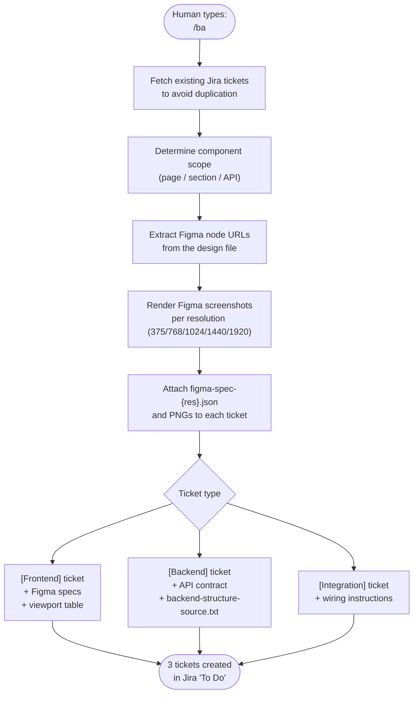
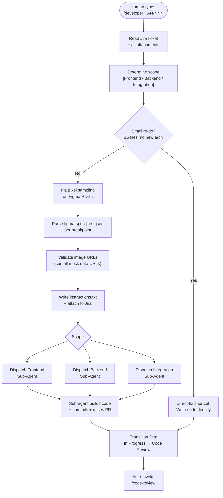
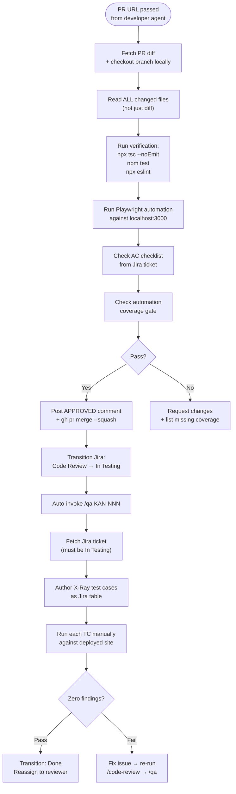
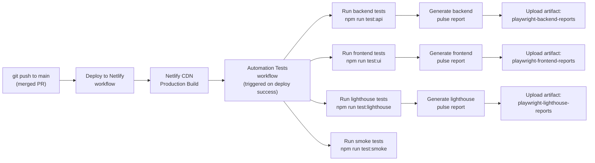

# Estatein — Agentic Full-Stack Development Showcase

A pixel-perfect real-estate web platform built entirely by an **AI agent pipeline** — from business requirements to deployed production code — with zero manual implementation by the human developer. The human's role is to define tickets, approve PRs, and orchestrate the agents.

---

## What This Repository Is

**Estatein** is a fully functional real-estate web application (property listings, services, contact forms, about page, terms) built to demonstrate an end-to-end autonomous software development workflow. Every feature, every component, every test, and every CI pipeline step was authored by a coordinated team of AI sub-agents operating under the Claude Code CLI.

The codebase itself is the artifact. The real deliverable is proof that a structured multi-agent system can take a Figma design + a Jira ticket and produce production-ready, Playwright-tested, CI-verified code — without a human writing a single line.

---

## Tech Stack

| Layer | Technology |
|---|---|
| Framework | Next.js 15 (App Router) |
| Language | TypeScript |
| Styling | Tailwind CSS v4 (custom breakpoints via `@theme inline`) |
| Font | Urbanist (Google Fonts, site-wide) |
| Database | Prisma + SQLite |
| API Layer | Next.js Route Handlers |
| Test Framework | Playwright |
| Test Reporter | `@arghajit/playwright-pulse-report` |
| CI/CD | GitHub Actions → Netlify |
| Agent Orchestration | Claude Code CLI + Hermes agent + custom skill files |

---

## Application Pages

| Route | Description |
|---|---|
| `/` | Hero, stats, featured properties, services preview, testimonials |
| `/properties` | Paginated property grid with search, Figma-matched card layout |
| `/services` | Three service sections (Property Selling, Management, Investment Advisory) |
| `/about-us` | Company story, team, achievements |
| `/contact` | General enquiry + property enquiry forms |
| `/terms` | Terms & conditions |

---

## The Agentic Workflow

### Overview

The full pipeline runs left-to-right: a human writes a one-line intent in Jira, and six agents carry it through to a merged, tested, production-deployed feature.

```mermaid
flowchart LR
    H(["Human\nProduct Owner"])
    BA["Business Analyst\nAgent"]
    SD["Senior Developer\nAgent"]
    FE["Frontend / Backend /\nIntegration Sub-Agent"]
    CR["Code Review &\nMerge Agent"]
    QA["QA Agent\n(SDET)"]
    CI["GitHub Actions\nCI Pipeline"]
    NET["Netlify\nProduction"]

    H -->|"Raw idea /\nJira ticket"| BA
    BA -->|"3 scoped tickets +\nFigma specs attached"| SD
    SD -->|"instructions.txt +\nexecution plan"| FE
    FE -->|"Feature branch +\nPR raised"| CR
    CR -->|"AC verified +\nPR merged"| QA
    QA -->|"Playwright tests\ncommitted to repo"| CI
    CI -->|"Deploy workflow\nsucceeds"| NET
    NET -->|"Automation Tests\ntriggered post-deploy"| CI
```



---

### 1. Business Analyst Agent (`/ba`)

Receives a raw idea from the human and decomposes it into exactly three Jira tickets per component:



**Key rules:**
- Max 8 story points per ticket
- Every Frontend ticket gets per-resolution Figma JSON specs and PNGs attached
- Naming convention: `[Frontend] Component Name`, `[Backend] Component Name`, `[Integration] Component Name`

---

### 2. Senior Developer Agent (`/developer`)

Analyzes the Jira ticket, performs PIL pixel sampling on Figma screenshots to extract exact colors, writes `instructions.txt`, and dispatches the correct sub-agent:



**Key rules:**
- Figma JSON values override PIL-sampled values when both exist for the same breakpoint
- All image URLs in mock data must return HTTP 200 before dispatch
- Sub-agents receive a `DESIGN THEME` block with exact RGB values extracted by PIL

---

### 3. Code Review & Merge Agent + QA Agent



**Key rules:**
- Hard gate: automation coverage must exist for every new user-visible behavior
- Self-approval workaround: post verdict as `gh pr comment --body-file`, then `gh pr merge --squash`
- QA must run against the **deployed** Netlify URL, not localhost

---

## CI/CD Pipeline



**Key behaviors:**
- All three test suites run with `continue-on-error: true` so one failure doesn't skip the rest
- `PULSE_REPORT_DIR` env var passed per suite; `--outputDir` flag also passed to `generate-pulse-report` CLI (the CLI parses config with a string-literal regex and can't resolve dynamic expressions)
- Reports are stored as separate named artifacts, never mixed

---

## Project Structure

```
agentic-full-stack-development/
├── src/
│   ├── app/
│   │   ├── globals.css          # Tailwind v4 theme (--breakpoint-desktop: 90rem)
│   │   ├── page.tsx             # Home page
│   │   ├── properties/          # Property listing page + route handler
│   │   ├── services/            # Services page + route handler
│   │   ├── about-us/            # About page + route handler
│   │   ├── contact/             # Contact page + route handler
│   │   ├── terms/               # Terms page
│   │   └── api/                 # All API route handlers
│   ├── components/
│   │   ├── sections/            # Page sections (Hero, PropertiesGrid, ServicesPreview…)
│   │   ├── ui/                  # Reusable UI primitives (Button, Card, Skeleton…)
│   │   └── layout/              # Navbar, Footer
│   ├── lib/                     # Prisma client, utility helpers
│   └── types/                   # Shared TypeScript types
├── prisma/
│   ├── schema.prisma            # Database schema
│   └── seed.ts                  # Seed data (matches Figma mock content exactly)
├── test-automation/
│   ├── playwright.config.ts     # 4 Playwright projects: frontend/backend/lighthouse/smoke
│   ├── specs/
│   │   ├── frontend-integration-test/   # UI component + API integration specs
│   │   ├── backend-test/                # Route handler API specs
│   │   ├── lighthouse-test/             # Performance/accessibility audits
│   │   └── smoke-test/                  # Post-deploy sanity checks
│   ├── pages/                   # Page Object Models (POM)
│   ├── locators/                # Centralised CSS/data-testid selectors
│   └── constants/               # Routes, viewports, text constants, API paths
├── .github/workflows/
│   ├── deploy.yml               # Build + Netlify deploy on push to main
│   └── automation.yml           # 3-suite Playwright run triggered after deploy
└── public/images/               # Hero images, property photos, abstract design assets
```

---

## Local Development

### Prerequisites

- Node.js 20+
- npm

### Setup

```bash
# Clone the repository
git clone https://github.com/Arghajit47/agentic-full-stack-development.git
cd agentic-full-stack-development

# Install dependencies
npm install

# Generate Prisma client and seed the database
npx prisma generate
npx prisma db push
npm run seed

# Start the development server
npm run dev
```

Open [http://localhost:3000](http://localhost:3000).

### Run Tests Locally

```bash
cd test-automation
npm install
npx playwright install --with-deps chromium

# Run individual suites
BASE_URL=http://localhost:3000 npm run test:api
BASE_URL=http://localhost:3000 npm run test:ui
BASE_URL=http://localhost:3000 npm run test:smoke
```

---

## Figma Fidelity Enforcement

Every Frontend ticket ships with:

1. **Per-resolution Figma JSON specs** (`figma-spec-{375|768|1024|1440|1920}.json`) — attached to the Jira ticket by the BA agent, parsed by the Senior Developer agent before dispatch
2. **PIL pixel sampling** — the Senior Developer agent samples every attached Figma screenshot programmatically (`Image.getpixel(x, y)`) to extract exact hex/RGB values for backgrounds, text, borders, and accents
3. **Tailwind custom breakpoints** — `--breakpoint-desktop: 90rem` defined in `@theme inline` so the `desktop:` utility is cascade-ordered correctly (after `lg:` and `xl:`) in Tailwind v4's generated CSS

The result is that every component matches the Figma design at all five breakpoints without manual pixel-pushing.

---

## Agent Skills Reference

| Skill | Trigger | Responsibility |
|---|---|---|
| `ba` | `/ba <idea>` | Decompose idea → 3 Jira tickets + Figma specs |
| `developer` | `/developer KAN-NNN` | Analyze ticket → dispatch sub-agent → raise PR |
| `pr-review-and-merge` | `/code-review <PR_URL>` | AC verification → merge → transition Jira |
| `qa` | `/qa KAN-NNN` | X-Ray test cases → zero-findings gate → Done |
| `jira-workflow` | (internal) | Jira transition IDs + assignee GUIDs |

All handoffs between skills are **automatic** — the agent pipeline runs end-to-end without human intervention once a `/developer` command is issued.
